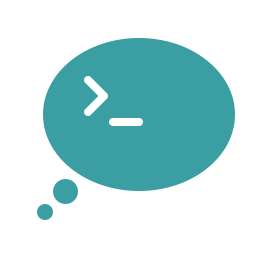

# Icquai

*Future of realtime communication realized.*

https://icquai.com/ (Work in progress)

Codename | (Modern) Japanese | Late Middle Japanese
---------|-------------------|----------------------
Icquai | 一会 (いっかい) /ˈiQkai/ <a href="#f1">[1]</a><a href="#f2">[2]</a> | /iQkwai/ [?][citation needed]

Language | Meaning
---------|---------
English | Meeting just once / a moment
Japanese | 「一度だけ会うこと。ただ一度の対面」「しばらく。わずかな時間」

Naming is done by [@MAJUKYI](https://github.com/MAJUKYI).

Source: _Hōyaku Nippo jisho_ (1980), p.330.

----

WebRTC peer-to-peer ephemeral chat in text and voice calls.

## License

Copyright &copy; 2021 真空 and Menhera.org developers. All rights reserved.

Licensed under the GNU Affero General Public License, version 3.0 or any later version.

Some parts of the code may contain materials available in other compatible licenses.

## Authors

* 真空 ([@metastable-void](https://github.com/metastable-void)); Cofounder at Menhera.org. Twitter [@masora_m](https://twitter.com/intent/user?user_id=847315328744865793).

----

## Footnotes

<a href="#a1" id="f1">1:</a> Q = mora phoneme. Commonly spelled like "ikkai." [More at Wikipedia](https://en.wikipedia.org/wiki/Japanese_phonology#Gemination).

<a href="#a2" id="f2">2:</a> The accent mark here specifies the pitch accent in modern Tokyo dialect; ie. HLLL
